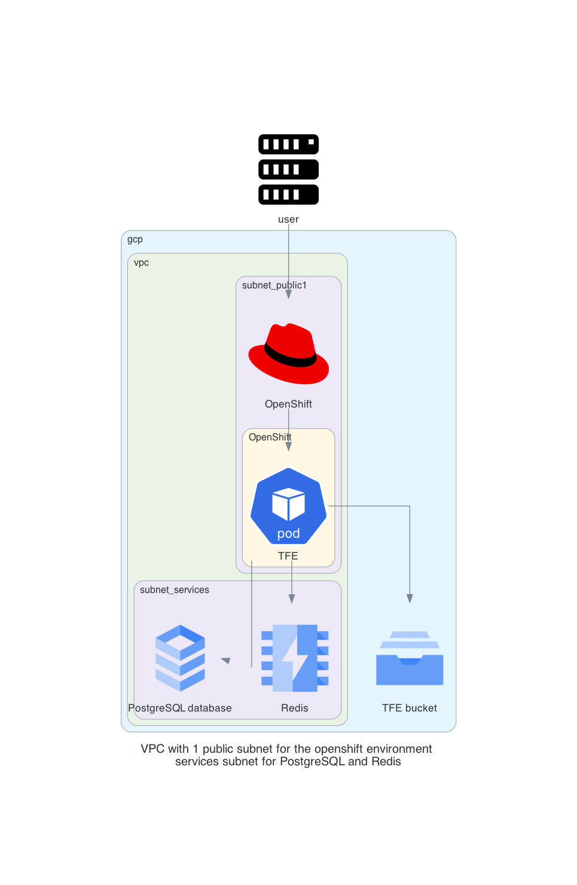

# Terraform Enterprise FDO - External on Google Cloud Platform

This is a repository to have a TFE FDO with OpenShift on GCP. This is using a PostgreSQL, Redis and a bucket from GCP. 

# Diagram

  

# Prerequisites

## License
Make sure you have a TFE license available for use

## GCP

Have your GCP credentials configured

```
gcloud config set account <your account>
gcloud auth activate-service-account --key-file=key.json
gcloud config set project <your project>
export USE_GKE_GCLOUD_AUTH_PLUGIN=True      # needed to work correctly with kubectl and getting credentials later
```

## RedHat

- Have a RedHat account
- Have the openshift installer tool available [here](https://console.redhat.com/openshift/install/gcp/installer-provisioned)
- Have the pull secret  
  

#### API enabled for
- Compute Engine API
- Cloud Resource Manager API
- Google DNS API
- IAM Service Account Credentials API
- Identity and Access Management (IAM) API
- Service Usage API
- Google Cloud APIs
- Service Management API
- Google Cloud Storage JSON API
- Cloud Storage
- Cloud SQL admin API
- Google Cloud Memorystore for Redis API
- Service Networking API
 

#### Following roles assigned to your account

Option 1:
- have the owner assigned to the account

Option 2:
- Compute Network Admin
- Compute Storage Admin
- Editor
- Project IAM Admin
- kubernetes engine admin
- Compute Instance Admin (v1)
- Compute Security Admin
- Compute Viewer
- DNS Administrator
- Quota Viewer
- Security Admin
- Service Account Admin
- Service Account Key Admin
- Service Account User
- Storage Admin

## AWS

This repository uses AWS resources for the DNS resources and creating the DNS records

## Install terraform  
See the following documentation [How to install Terraform](https://learn.hashicorp.com/tutorials/terraform/install-cli)

## TLS certificate
You need to have valid TLS certificates that can be used with the DNS name you will be using to contact the TFE instance.  
  
The repo assumes you have no certificates and want to create them using Let's Encrypt and that your DNS domain is managed under AWS. 

## kubectl
Make sure kubectl is available on your system. Please see the documentation [here](https://kubernetes.io/docs/tasks/tools/).

## helm
Make sure helm is available on your system. Please see the documentation [here](https://helm.sh/docs/intro/install/)

# How to

- Clone the repository to your local machine
```sh
git clone https://github.com/munnep/tfe_fdo_gcp_external_openshift.git
```
- Add your gcp authentication key as `key.json` to the root directory of the repository

## Generate an Openshift environment
We will start by creating an OpenShift cluster on GCP using the install_openshift tool

- Make sure you copy the `key.json` file to your home directory `~/.gcp/`
```
mkdir ~/.gcp && cp hc-*********.json ~/.gcp/osServiceAccount.json
```
- Go to the directory 
```
cd tfe_fdo_gcp_openshift
```
- Make sure you have the openshift-install tool in this directory that you downloaded from the prereguisites step
- Use the openshift-install tool to start the installation wizard
```
./openshift-install create cluster --dir ./gcp/ --log-level=info
```
- Fill in all the information
example:
```
? Platform gcp
INFO Credentials loaded from file "/Users/patrickmunne/.gcp/osServiceAccount.json" 
? Project ID projects/378096******** (hc-**********)
? Region europe-west4
? Base Domain hc-**********.gcp.sbx.hashicorpdemo.com
? Cluster Name patrick-openshift
? Pull Secret [? for help] **************
```
- Wait for around 45 minutes until everything is finished
```
INFO Install complete!                            
INFO To access the cluster as the system:admin user when using 'oc', run 'export KUBECONFIG=/Users/patrickmunne/git/tfe_fdo_gcp_openshift/gcp/auth/kubeconfig' 
INFO Access the OpenShift web-console here: https://console-openshift-console.apps.patrick-openshift.hc-**********************.gcp.sbx.hashicorpdemo.com 
INFO Login to the console with user: "kubeadmin", and password: "********" 
INFO Time elapsed: 37m57s 
```
- set your kubeconfig correct
```
export KUBECONFIG=/Users/patrickmunne/git/tfe_fdo_gcp_openshift/gcp/auth/kubeconfig'
```
- Test the kubectl
```
kubectl get namespaces

NAME                                               STATUS   AGE
default                                            Active   36m
kube-node-lease                                    Active   36m
kube-public                                        Active   36m
```
- Verify you can login to your console
  
- Within GCP you should now see some VM instances  
   
- Get the value from the VPC network that is created. We need this in the upcoming steps   
Example: `patrick-openshift-z7ljb-network`
  

## Now you will need to create the infrastructure for TFE
- Go to the directory  
```sh
cd tfe_fdo_gcp_external_gcp/infra
```
- create a file called `variables.auto.tfvars` with the following contents and your own values
```
# General
tag_prefix        = "tfe31"                            # TAG prefix for names to easily find your AWS resources
# gcp
gcp_region        = "europe-west4"                     # GCP region creating the resources
vnet_name         = "patrick-openshift-z7ljb-network"  # GCP vnet created by openshift installer
gcp_project       = "hc-**************"                # GCP project id (found in keys.json)
gcp_location      = "EU"                               # location to create SQL and bucket 
rds_password      = "Password#1"                       # password used for PostgreSQL
```
- Terraform initialize
```
terraform init
```
- Terraform plan
```
terraform plan
```
- Terraform apply
```
terraform apply
```
- Terraform output should create 14 resources and show outputs used by the next steps
```
Plan: 14 to add, 0 to change, 0 to destroy.

Outputs:

Outputs:

gcp_location = "EU"
gcp_project = "hc-0fe72caaa1cc4492bbb9fff137d"
gcp_region = "europe-west4"
google_bucket = "tfe31-bucket"
pg_address = "10.95.1.3"
pg_dbname = "tfe"
pg_password = <sensitive>
pg_user = "admin-tfe"
prefix = "tfe31"
redis_host = "10.95.0.3"
redis_port = 6379
storage_credentials = <sensitive>
```

## Now you will need to deploy Terraform Enterprise on to this cluster

- Go to the directory `../tfe`
```
cd ../tfe
```
- Create a file called `variables.auto.tfvars` with the following contents
```
dns_hostname               = "tfe31"                                   # Hostname used for TFE
dns_zonename               = "aws.munnep.com"                          # DNS zone where the hostname record can be created
certificate_email          = "patrick.munne@hashicorp.com"             # email address used for creating valid certificates
tfe_encryption_password    = "Password#1"                              # encryption key used by TFE
tfe_license                = "02MV4UU43BK5HGYYTOJZ"                    # TFE license as a string
replica_count              = 1                                         # Number of replicas for TFE you would like to have started
tfe_license                = "<your_tfe_license_raw_text>"             # Your TFE license in raw text
tfe_release                = "v202406-1"                               # The version of TFE application you wish to be deployed. Beta version v202406-1
# AWS
region                     = "eu-north-1"                              # To create the DNS record on AWS          
```
- Initialize the environment
```
terraform init
```
- Create the environment
```
terraform apply
```
- This will create 7 resources
```
Apply complete! Resources: 7 added, 0 changed, 0 destroyed.

Outputs:

execute_script_to_create_user_admin = "./configure_tfe.sh tfe31.aws.munnep.com patrick.munne@hashicorp.com Password#1"
tfe_application_url = "https://tfe31.aws.munnep.com"
```
- Execute the `configure_tfe.sh tfe31.aws.munnep.com patrick.munne@hashicorp.com Password#1` script to do the following
  - Create a user called admin with the password specified
  - Create an organization called test
- login to the application on url https://tfe31.aws.munnep.com

# TODO

# DONE
- [x] build network according to the diagram
- [x] create openshift
- [x] Create redis
- [x] create PostgreSQL instance
- [x] create a bucket
- [x] Create a valid certificate to use 
- [x] install TFE using helm chart
- [x] point dns name to loadbalancer 